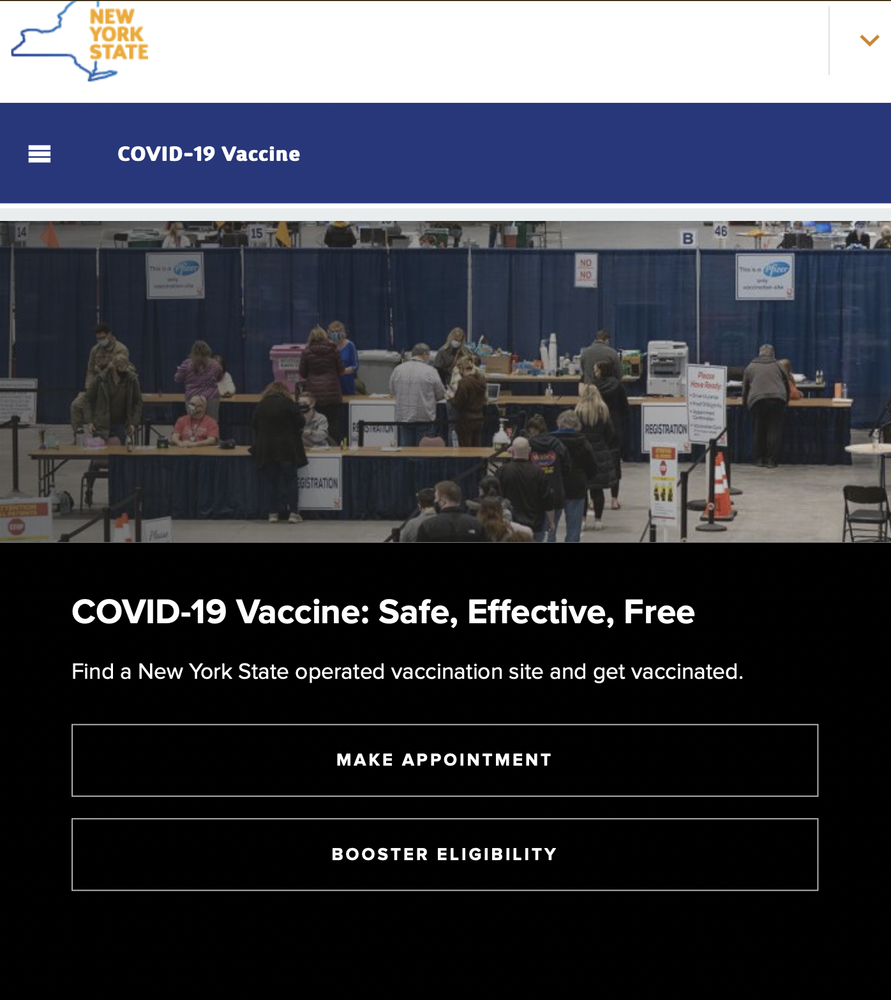

# Pilot-UT
## Introduction to covid19vaccine.health.ny.gov
covid19vaccine.health.ny.gov is a website that is designed to allow citizens to make appointments to get their COVID-19 vaccines. While this is the primary function of the site, there are amny other informative reasources about each vaccine type.
## covid19vaccine.health.ny.gov homepage as of October 6, 2021

## Purpose of UT and Tests
UT tests are used to detect issues within site based on watching a user behave with the site. This is very useful as it's main goal is for the site to be able to be used by all, regardless of age. In this user test, I will be testing the menu function(s), search functions, and appointment function as these are the most integral to this site's main purpose as well as functions that I found to be slightly confusing during my heuristic evaluation. I aim to pinpoint why these functions are confusing by completing this user test.
## UT Setting
The UT setting was in person and we recorded through zoom. We recorded the test in the living room and used a Macbook Pro with iOS software and a built in micorphone and camera.
## Nature of Usability Testing
This test was a pilot test with my roomate. After the pilot test, our inteded audience is the elderly.
## Process
I introduced the project to my user and provided them with an introduction as well as background information. I set up the usability test using an introduction, informed consent, pre-test questions, three tasks, post-test questions, system usability scale (SUS), and production satisfation card. This process was conducted via Google forms. I had my user do basic tests to focys on how easy to navigate the website is and overall satisfaction with the site.
## Survey Form
[Survey for our user test](https://docs.google.com/forms/d/e/1FAIpQLSeSeKuzY7jPMjPZy17KAeY0hnT8v4wjRY9v1GBxvsCxHEJffw/viewform?usp=sf_link)
## Video Recording of UT
[Youtube Video](https://www.youtube.com/watch?v=_-vrNeSAfJ8)
## Reflection and Experience
After making my Google Form, I was confident our test would run smoothly as the site is mainly informative. Once we began the test, I realized that I was unfortunately wrong. There were a few errors with my Google Form itself, which is expected as I have never made a Google Form or conducted a User Test. There were also many issues on the site that we ran into which the average, every day user most likely runs into as well. Although we encountered issues, I was able to confidently explain the questions to my user. My user was very communicative but it is very important to realize that not all users are this expressive. Due to this, I believe it would be wise for me to add more questions to each task as well as ask how the user felt after the tasks.
